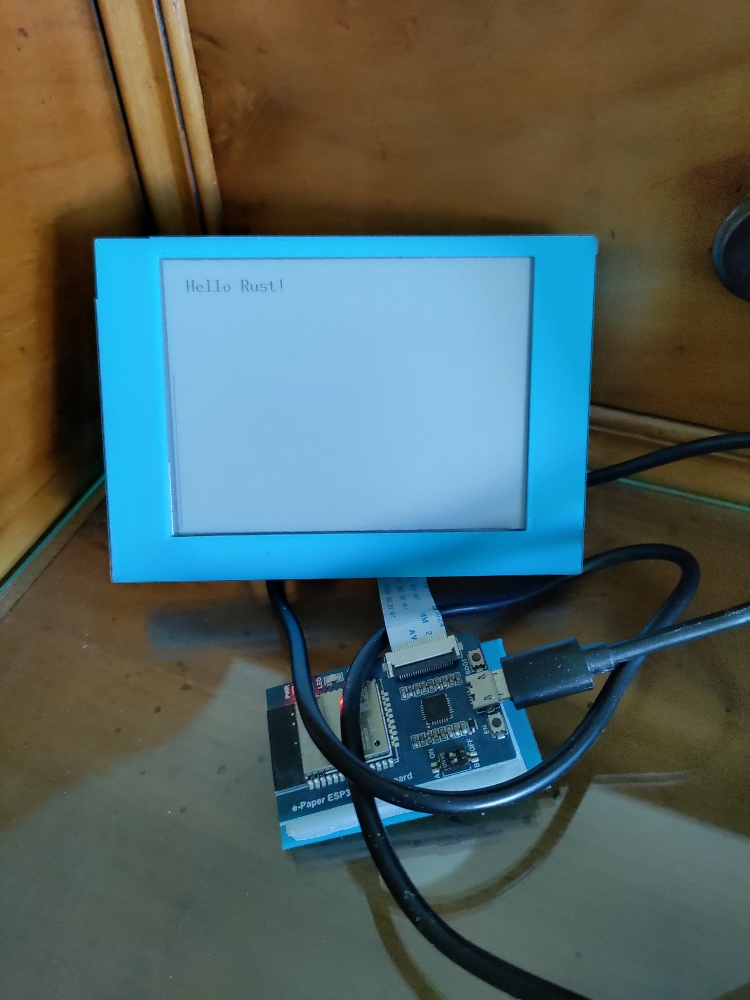

# Simple example of Rust executing on e-Paper ESP32 Driver Board and waveshare 4.2" epaper

## Setup Build Environment

Follow https://github.com/esp-rs/rust-build installation  
Install esp-idf : https://github.com/espressif/esp-idf  
    
    cargo install -f ldproxy espflash espmonitor  

## Build and flash this project :

    cargo build
    espflash /dev/ttyUSB0 target/xtensa-esp32-espidf/debug/rust-esp32-waveshare-4_2

## Result

## Dependancy 
https://docs.rs/epd-waveshare/latest/epd_waveshare/  
https://github.com/esp-rs/esp-idf-hal  

## Thanks

Thanks [ivmarkov](https://github.com/ivmarkov) for the simplest example on how to build and flash rust on ESP32 and all dependancy crate maintainer 
